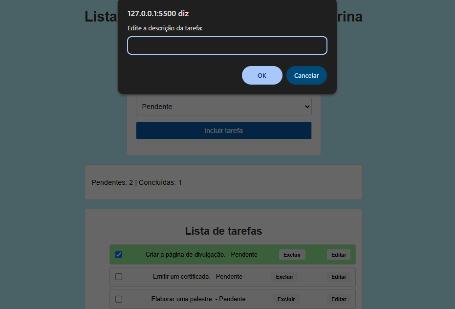

# To-Do List Inteligente - Avaliação Front End

Este é um projeto de uma **Lista de Tarefas Interativa**, desenvolvido para gerenciar tarefas de forma simples e eficiente. O projeto permite adicionar, editar, excluir e marcar tarefas como concluídas, além de exibir a contagem de tarefas pendentes e concluídas.

## 🛠️ Funcionalidades

- **Adicionar Tarefa**: Insira uma descrição e adicione a tarefa à lista.
- **Marcar como Concluída**: Use o checkbox para marcar uma tarefa como concluída. O fundo da tarefa será alterado para verde.
- **Editar Tarefa**: Edite a descrição de uma tarefa existente.
- **Excluir Tarefa**: Remova uma tarefa da lista.
- **Contagem de Tarefas**: Exibe o número de tarefas pendentes e concluídas em tempo real.

## 📂 Estrutura do Projeto
### **index.html**
- Contém a estrutura da página, incluindo os campos de entrada, botões e a lista de tarefas.

### **styles.css**
- Define o estilo visual do projeto, como cores, fontes e layout.
- Destaques:
  - Tarefas concluídas têm fundo verde.
  - Botões de excluir e editar com cores distintas e efeitos de hover.

### **script.js**
- Gerencia a lógica do projeto, incluindo:
  - Adicionar tarefas.
  - Atualizar a contagem de tarefas pendentes e concluídas.
  - Editar e excluir tarefas.
  - Alterar o estilo das tarefas com base no status.

  ## 🎨 Estilo
- Cor de fundo: Azul claro (#b9f2fc).
- Fundo padrão: Cinza claro (#f9f9f9).
- Fundo concluído: Verde claro (lightgreen).

## 📷 Demonstração

Desenvolvido pelo aluno Gabriel Pinto Gonzales.
